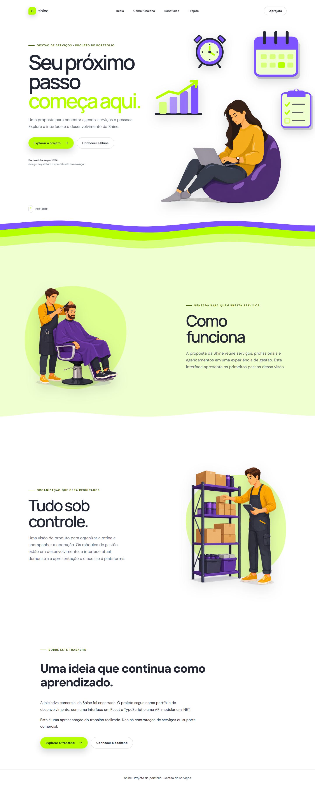

# Shine · Frontend

Interface de uma plataforma de gestão de serviços com **React, TypeScript e Vite**. O projeto explora identidade visual, navegação e autenticação para múltiplas unidades de atendimento.

> **Projeto de portfólio.** A iniciativa comercial foi encerrada. O trabalho continua como espaço de evolução técnica, sem oferta comercial ou suporte de produção.

[Backend](https://github.com/Shine-Solucoes-Tecnologicas/Shine-Backend) · [Contribuição](CONTRIBUTING.md) · [Segurança](SECURITY.md)

## Visão geral



[Ver a versão mobile](docs/images/landing-mobile.png)

## O que está implementado

- Landing page responsiva com identidade visual própria.
- Navegação entre apresentação, proposta de produto e código-fonte.
- Capturas da interface em desktop e mobile.
- Teste de navegador para cookies SameSite=Lax, como estudo de integração.

Esta versão pública apresenta a landing page. Autenticação, seleção de unidade e área interna estão em trabalho local e não fazem parte desta publicação. Não há cadastro, credenciais de demonstração ou serviço comercial ativo.

## Executar localmente

Pré-requisitos: Node.js 24 e npm. Use o lockfile versionado para instalar as dependências.

```bash
npm ci
npm run dev
```

Abra http://localhost:5173. A apresentação funciona sem backend. A futura integração deve seguir a [configuração da API](https://github.com/Shine-Solucoes-Tecnologicas/Shine-Backend/blob/main/docs/configuration.md).

## Validação

```bash
npm run build
npx playwright install chromium
npm run test:e2e
```

O build verifica TypeScript e gera `dist/`. O teste atual sobe servidores nas portas 4173 e 4174; deixe essas portas livres. Ele verifica a política de cookies do navegador, não o fluxo completo de autenticação contra a API.

## Organização

```text
src/components/    Elementos visuais
src/main.tsx       Landing page
src/styles.css     Identidade visual e layouts responsivos
public/images/     Ilustrações da interface
tests/e2e/         Verificações no navegador
```

## Próximos passos de portfólio

- Criar uma demonstração navegável com dados fictícios e sem cadastro.
- Conectar as telas de agenda e catálogo aos contratos existentes.
- Ampliar a cobertura de acessibilidade e autenticação.

## Uso do código

Disponibilizado para apresentação e consulta. Nenhuma licença de código aberto foi concedida; consulte [NOTICE.md](NOTICE.md). Recursos visuais não recebem licença de redistribuição por estarem neste repositório.
